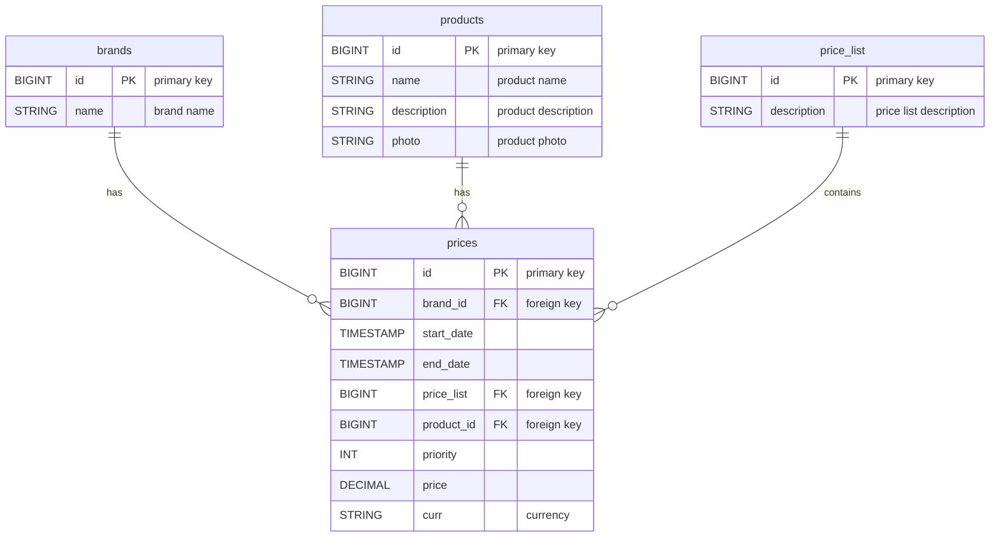

# between-spring-boot-test-app

A practical Spring Boot application demonstrating the implementation of a real-world solution.

## Description

This is a Spring Boot application that implements a price service using WebFlux and gRPC to provide a reactive API that
manages price operations.
The application is connected to an in-memory H2 database with migrations managed by Flyway.

## Features

- **REST API**: For HTTP operations using WebFlux.
- **gRPC**: For asynchronous and protocol-based interactions from clients.
- **Database**: Uses H2 in-memory for testing and development.
- **Migrations**: Automatic database schema management with Flyway.

## Requirements

- JDK 21 or higher
- Maven
- Docker (optional, if you want containers)

## Installation

1. **Clone the Repository**:
   ```bash
   git clone https://github.com/edeldelgado90/between-spring-boot-test-app.git
   cd between-spring-boot-test-app
   ```
2. **Build the Project**:
    ```bash
    mvn clean install
    ```
3. **Run the application**:
    ```bash
    mvn spring-boot:run
    ```
4. **Access the H2 Console**:
   You can access the H2 console at:
    ```
    http://localhost:8080/h2-console
    ```
   Use the following connection URL:
    ```
    jdbc:h2:mem:testdb
    ```

## Database Information

The following tables are created during the migration process:

```sql
CREATE TABLE brands
(
    id   BIGINT PRIMARY KEY,
    name VARCHAR(255) NOT NULL
);

CREATE TABLE products
(
    id          BIGINT PRIMARY KEY,
    name        VARCHAR(255) NOT NULL,
    description TEXT,
    photo       VARCHAR(255)
);

CREATE TABLE price_list
(
    id          BIGINT PRIMARY KEY,
    description VARCHAR(255)
);

CREATE TABLE prices
(
    id         BIGINT AUTO_INCREMENT PRIMARY KEY,
    brand_id   BIGINT         NOT NULL,
    start_date TIMESTAMP      NOT NULL,
    end_date   TIMESTAMP      NOT NULL,
    price_list BIGINT         NOT NULL,
    product_id BIGINT         NOT NULL,
    priority   INT            NOT NULL,
    price      DECIMAL(10, 2) NOT NULL,
    curr       VARCHAR(3)     NOT NULL,
    FOREIGN KEY (brand_id) REFERENCES brands (id),
    FOREIGN KEY (product_id) REFERENCES products (id),
    FOREIGN KEY (price_list) REFERENCES price_list (id),
    CONSTRAINT unq_price UNIQUE (brand_id, product_id, curr, price_list, priority)
);

CREATE INDEX idx_price_brand_product ON prices (brand_id, product_id);
CREATE INDEX idx_price_start_end ON prices (start_date, end_date);
````

The application inserts the following default data into the tables upon startup:

```sql
INSERT INTO brands (id, name)
VALUES (1, 'ZARA');

INSERT INTO products (id, name, description)
VALUES (35455, 'JEANS MARINE',
        'Jeans marine fit con cinturilla interior ajustable y cierre botón frontal. Bolsillos tipo plastrón en espalda.');

INSERT INTO price_list (id, description)
VALUES (1, 'Listado de Precios del 2020 - 1'),
       (2, 'Listado de Precios del 2020 - 2'),
       (3, 'Listado de Precios del 2020 - 3'),
       (4, 'Listado de Precios del 2020 - 4');

INSERT INTO prices (brand_id, start_date, end_date, price_list, product_id, priority, price, curr)
VALUES (1, '2020-06-14 00:00:00', '2020-12-31 23:59:59', 1, 35455, 0, 35.50, 'EUR'),
       (1, '2020-06-14 15:00:00', '2020-06-14 18:30:00', 2, 35455, 1, 25.45, 'EUR'),
       (1, '2020-06-15 00:00:00', '2020-06-15 11:00:00', 3, 35455, 1, 30.50, 'EUR'),
       (1, '2020-06-15 16:00:00', '2020-12-31 23:59:59', 4, 35455, 1, 38.95, 'EUR');
```

## Database Schema Diagram

Below is a diagram representing the relationships between the tables using Mermaid syntax. You can render this using a
Mermaid-compatible viewer.



## REST API Endpoints

### Create a Price

#### POST `/api/prices`

Example Request Body:

```json
{
  "brandIdd": 1,
  "startDate": "2023-01-01T00:00:00",
  "endDate": "2023-12-31T23:59:59",
  "priceList": 1,
  "productId": 35455,
  "priority": 1,
  "price": 100.00,
  "curr": "EUR"
}
```

Curl Example:

```bash
curl -X POST http://localhost:8080/api/prices \
  -H "Content-Type: application/json" \
  -d '{
        "brandId": 1,
        "startDate": "2023-01-01T00:00:00",
        "endDate": "2023-12-31T23:59:59",
        "priceList": 1,
        "productId": 35455,
        "priority": 1,
        "price": 100.00,
        "curr": "EUR"
      }'
```

### Get Current Price

#### GET `/api/prices/current?product_id={id}&brand_id={id}&date={date}`

Curl Example:

```bash
curl -X GET http://localhost:8080/api/prices/current?product_id=35455&brand_id=1&date=2020-07-01T12:00:00 \
  -H "Content-Type: application/json"
```

### Delete a Price

#### DELETE `/api/prices/{id}`

Curl Example:

```bash
curl -X DELETE http://localhost:8080/api/prices/1 \
  -H "Content-Type: application/json"
```

## Accessing the OpenAPI Documentation

Once the application is running, you can access the OpenAPI documentation through the following URL:

[http://localhost:8080/swagger-ui.html](http://localhost:8080/swagger-ui.html)

## gRPC Usage

To use gRPC, ensure you have grpcurl installed and use the following command to invoke the service:

```bash
grpcurl -plaintext -d '{
    "productId": 35455,
    "brandId": 1,
    "date": "2020-06-14T20:32:05Z"
}' localhost:9090 prices.PriceService/GetCurrentPriceByProductAndBrand
```

## Running Tests

To run unit and integration tests:

```bash
mvn test
```
